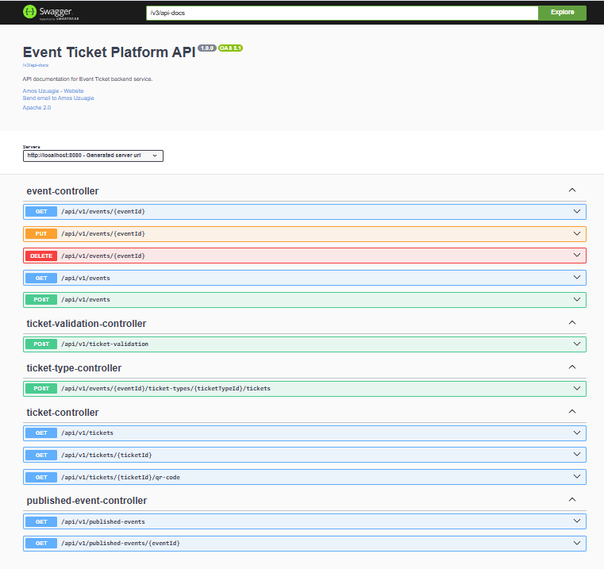

# 🎟️ Events Ticket Platform

## 📌 Project Overview

The **Events Ticket Platform** is a complete **event management lifecycle system**.  
It supports:

1. **Event Organizers** – create, update, publish, and manage events.
2. **Event Attendees** – browse published events, purchase tickets, and access QR codes.
3. **Event Staff** – validate tickets at entry points.

Key features include:

- Event creation & management (with multiple ticket types).
- Secure ticket purchases.
- QR code generation for each ticket.
- Ticket validation at events.
- Sales monitoring for organizers.

---

## 🧾 User Story Analysis

### Event Creation Requirements

- Organizers can set up events with:
  - **Name, date, time, venue**
  - **Multiple ticket types** (with varying prices & limits)
- System ensures **data integrity** to prevent duplicates and invalid configurations.

### Ticket Purchase Flow

- Attendees can purchase tickets securely.
- Tickets include **unique QR codes** for validation.
- Ticket validation status is tracked during entry.

---

## 📦 Dependencies

| Dependency               | Purpose                          |
| ------------------------ | -------------------------------- |
| Spring Boot Web          | REST APIs                        |
| Spring Data JPA          | Data persistence with PostgreSQL |
| Spring Security + OAuth2 | Authentication & Authorization   |
| PostgreSQL               | Production database              |
| H2                       | In-memory DB for testing         |
| Lombok                   | Reduces boilerplate code         |
| MapStruct                | Entity ↔ DTO mapping             |

---

## 📡 API Endpoints

All REST APIs are documented via **OpenAPI/Swagger**.  
📸 API Documentation Screenshot:

